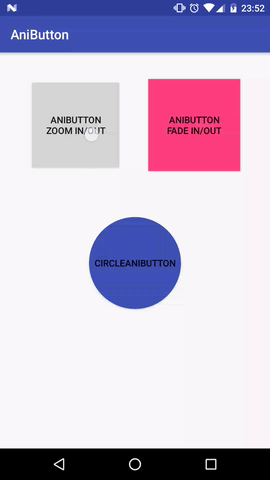

[](https://www.jitpack.io/#IlyaPavlovskii/AniButton)

# AniButton
Now you can transform touch effect on Button widget. Use custom animation on button.

<p align="center">
  
</p>

## Install
Add it in your root build.gradle at the end of repositories:
```gradle
allprojects {
    repositories {
        maven { url 'https://jitpack.io' }
    }
}
```
Add dependency:
```gradle
dependencies {
        compile 'com.github.IlyaPavlovskii:AniButton:v1.2'
}
```
## How to use
Just add to you layout:
```xml
<by.ilya.pavlovskii.anibutton.AniButton
            android:layout_width="wrap_content"
            android:layout_height="wrap_content"
            app:anim_in="@animator/fade_in"
            app:anim_out="@animator/fade_out"/>
```
Use attribute ```app:anim_in``` to setup animation when you pressed the button. 
Set attribute ```app:anim_out``` to setup animation when you release the button.
You can use the java to set attributes:
```java
Animator inAnimator = ObjectAnimator.ofFloat(...);
Animator outAnimator = ObjectAnimator.ofFloat(...);
by.ilya.pavlovskii.anibutton.AniButton vAniButton = findViewById(R.id.vAniButton);
         
vAniButton.setInAnimator( inAnimator );
vAniButton.setOutAnimator( outAnimator );
// Or simple
vAniButton.setAnimator(inAnimator, outAnimator);
```

If you want to use circle button:
```xml
<by.ilya.pavlovskii.anibutton.CircleAniButton
            android:layout_width="100dp"
            android:layout_height="100dp"
            app:anim_in="@animator/zoom_in"
            app:anim_out="@animator/zoom_out"/>
```
Now your touch will be work only on circle area.

## Widgets
Available widget extensions is:
* ```AniButton``` - extends ```android.support.v7.widget.AppCompatButton```
* ```CircleAniButton``` - extends ```android.support.v7.widget.AppCompatButton``` with circle 
touch area effect
* ```AniImageButton``` - extends ```android.support.v7.widget.AppCompatImageButton```
* ```CircleAniImageButton``` - extends ```android.support.v7.widget.AppCompatImageButton``` with circle 
touch effect

# Licence

````
Copyright 2017 Ilya Pavlovskii

Licensed under the Apache License, Version 2.0 (the "License");
you may not use this file except in compliance with the License.
You may obtain a copy of the License at

http://www.apache.org/licenses/LICENSE-2.0

Unless required by applicable law or agreed to in writing, software
distributed under the License is distributed on an "AS IS" BASIS,
WITHOUT WARRANTIES OR CONDITIONS OF ANY KIND, either express or implied.
See the License for the specific language governing permissions and
limitations under the License.
````
